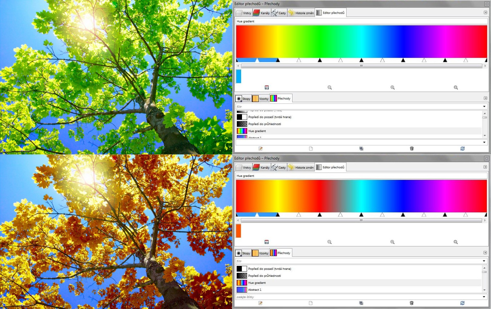
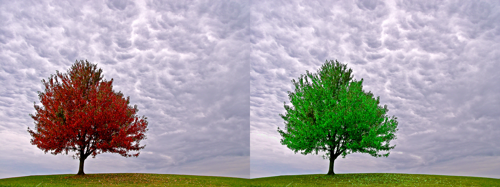
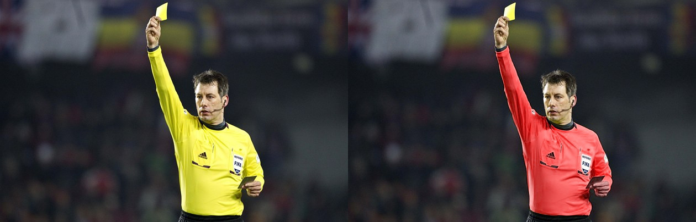

# hue-map-plugin
"Hue map" is a GIMP2 plugin for remapping image hue using a gradient.

What does that mean?
First, the plugin creates new gradient containing the whole Hue spectrum (from HSV model).
Then, the user can edit this gradient.
Finally, the plugin remaps the hue in each pixel by this gradient.
An example - let's say you don't like summer and you would prefer autumn:

Or deep down you really are a summer person and don't like autumn at all:

Or you don't care about what season it is as long as the game turns out the way you like it.

*This project was made within BI-PGA subject on FIT CTU in Prague*
